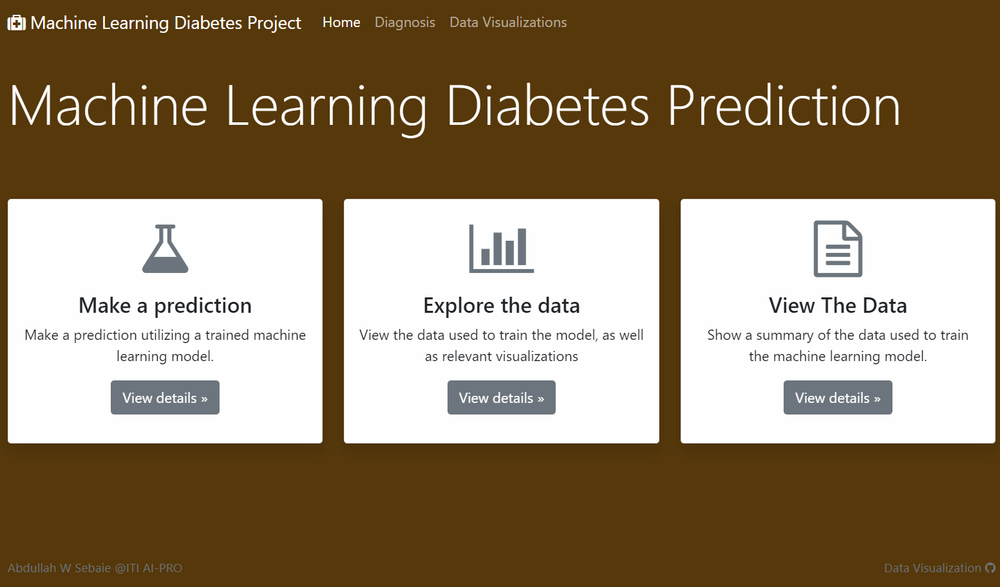
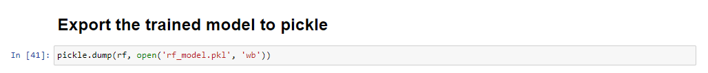

# Machine-Learning-Model-Diabetes-Prediction-with-Dashboard-ITI-
Machine Learning prediction Model  with Data visualization by Dash, Plotly, flask, html, CSS,JS and Python (AI_PRO Intake 1 @ ITI)

<h1>ITI-AI PRO INTAKE1 @ 2021</h1>
<h2>Machine Learning prediction Model  with Data visualization</h2>

<h2>Machine Learning prediction Model  with Data visualization</h2>

<h2>Machine Learning prediction Model  with Data visualization</h2>

<h2>Machine Learning prediction Model  with Data visualization</h2>

<h2>Machine Learning prediction Model  with Data visualization</h2>

<h2>Machine Learning prediction Model  with Data visualization</h2>

<h2>Machine Learning prediction Model  with Data visualization</h2>

<h2>Machine Learning prediction Model  with Data visualization</h2>

<h2>Machine Learning prediction Model  with Data visualization</h2>

<h2>Machine Learning prediction Model  with Data visualization</h2>

<h2>Machine Learning prediction Model  with Data visualization</h2>

<h2>Machine Learning prediction Model  with Data visualization</h2>

<h2>Machine Learning prediction Model  with Data visualization</h2>

<h2>Machine Learning prediction Model  with Data visualization</h2>

<h2>Machine Learning prediction Model  with Data visualization</h2>

<h2>Machine Learning prediction Model  with Data visualization</h2>

<h2>Machine Learning prediction Model  with Data visualization</h2>

<h2>Machine Learning prediction Model  with Data visualization</h2>

<h2>Machine Learning prediction Model  with Data visualization</h2>

<h2>Machine Learning prediction Model  with Data visualization</h2>

<h2>Machine Learning prediction Model  with Data visualization</h2>

<h2>Machine Learning prediction Model  with Data visualization</h2>

<h2>Machine Learning prediction Model  with Data visualization</h2>

<h2>Machine Learning prediction Model  with Data visualization</h2>

<h2>Machine Learning prediction Model  with Data visualization</h2>

<h2>Machine Learning prediction Model  with Data visualization</h2>

<h2>Machine Learning prediction Model  with Data visualization</h2>

<h2>Machine Learning prediction Model  with Data visualization</h2>

<h2>Machine Learning prediction Model  with Data visualization</h2>

<h2>Machine Learning prediction Model  with Data visualization</h2>

<h2>Machine Learning prediction Model  with Data visualization</h2>

<h2>Machine Learning prediction Model  with Data visualization</h2>

<h2>Machine Learning prediction Model  with Data visualization</h2>

<h2>Machine Learning prediction Model  with Data visualization</h2>

<h2>Machine Learning prediction Model  with Data visualization</h2>

